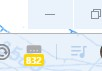

# Spoke Inspector
Here is the source code for a little Chrome extension that can help you track your texts in Spoke. If you want to make changes to the code, feel free to fork the repo!

## Installation
To install from source, first download make sure you clone the code to your own computer with `git clone https://github.com/timeforchang/spoke_inspector.git`. 

Make sure you have the following installed:
- Git: https://git-scm.com/book/en/v2/Getting-Started-Installing-Git
- Google Chrome: https://www.google.com/chrome/

Next, go to your "Extensions" page in Chrome. You can find the page by following the Google Chrome docs found here: https://support.google.com/chrome_webstore/answer/2664769?hl=en#/. 

In the "Extensions" page, make sure the "Developer mode" switch in the top right corner is turned **ON**. Next, click the "Load unpacked" button in the top left. This will launch a prompt for you to select the folder with all of the source code. Select the folder in the prompt, and you are ready to go! You will see the extension icon in the top right hand side of your Chrome window. Keep in mind that this extension operates on the assumption that the dashboard page for Spoke is `text.berniesanders.com/app/1/todos`. 

## Usage
This is a simple extension that will tell you the status of your Spoke page without you being physically on the page. It checks the HTML source of the Spoke page and counts the number of past/skipped, initial, and to be replied to messages in Spoke. The extension updates the count every time the Chrome tab with Spoke is updated or created. 

There are 2 different modes for the icon:
- Green: This means there are assignments available for you to request
- Grey: This means there are no assignments currently available

Additionally, there is a badge for the extension icon that will represent 4 different states:
- Orange badge: this means that you have replies that need to be sent. The number represents how many replies you have left. If you have replies, the badge will be orange regardless of how many initials or past/skipped messages you have.
- Green badge: this means you have no replies, but have initials. The number represents how many initials you have. This will show up regardless of how many past/skipped messages you have.
- Yellow badge: this means you have no messages to be sent at this time but you still have the a tab open with Spoke.
- No badge: this means you have no tab that has Spoke open

## Implementation Details
This section is for you to read about how inefficient the code might be. However, it works, so 🤷‍. Also, if you want to make sure that I am not stealing your credentials with this extension, head on over to the source code and manifest! 

The script sets a listener for every tab that is created, updated, and removed. There is also a listener attached for when the extension is first installed. 

These listeners will execute extra code only when they receive an event related to the a tab that has Spoke opened (specifically, with the URL: http(s)://text.berniesanders.com/app/1/todos). This extra code gets the DOM from the Spoke page, and counts up all of the badges for each assignment you have. 

These listeners are, however, activated any time a tab is opened, updated, or closed, which might lead to some overhead. This overhead is only an if statement check.

**Now for the sketchy part**: since the page isn't immediately loaded on a create or update event, I've set a timer to update after 1 second in the case of an update event and 5 seconds in the case of a new tab created with the Spoke URL as a workaround. If there is a better way to do this callback (like hook DOMNodeInserted or something), please let me know!

## Future Work
- Maybe a popup that breaks down the number of replies/initials for each campaign so you dont have to keep scrolling
- Publish this thing to the Chrome Web Store